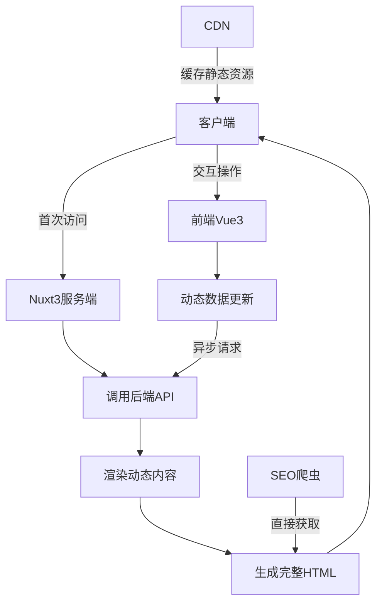
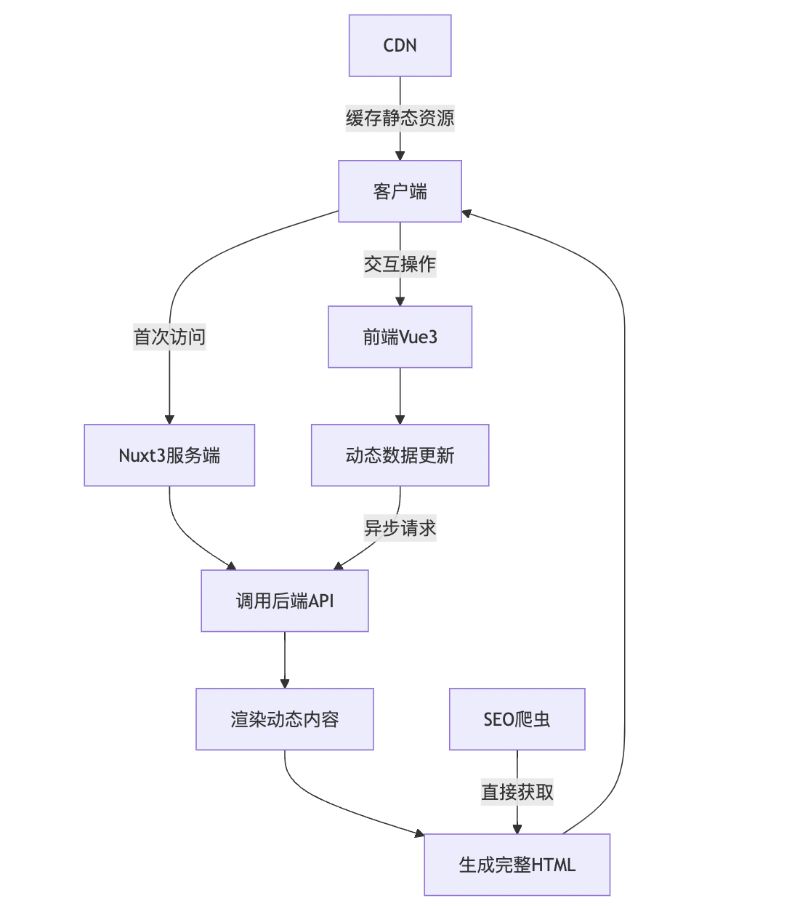
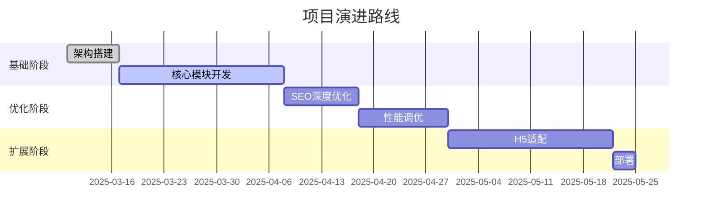

## 概述

一个创业公司的官网，需要支持SSR，SEO友好，动画效果好，扩展性强。

[原型](https://www.figma.com/design/wM9ijkfGpRjFX4xapMEohl/%E7%BD%91%E7%AB%99?node-id=0-1&m=dev&t=HBSSJIIFNrKOZ5bI-1 )

[参考](https://www.xivodesign.com/)

## 一、需求调研

1. 使用那种语言，js，ts -- 无特殊要求
2. 使用那种前端框架，vue，react或其它 -- 无特殊要求
3. 使用那种css框架，tailwindcss，unocss，或者其它 --无特殊要求
4. 使用那种组件库，element，antd或者其它 --无特殊要求
5. 是否兼容H5 -- 要支持移动端，但是目前没有出设计稿，自己看着做
6. 是否支持seo -- 要支持
7. 是否兼容浏览器，如需要，需要兼容到哪一个版本的浏览器 -- 无特殊要求
8. 是否需要动画效果，如果需要，使用那种动画库 -- 个别地方需要
9. 是否考虑扩展性，后期是否要在官网集成其它功能，比如客服等 -- 需考虑
10. 是否考虑多皮肤，比如肯定会用到的，某些特殊时刻全局置灰 -- 暂不考虑
11. 是否考虑多语言，也就是国际化 -- 暂不考虑

> 人员配置： 新手1人，主要的需求是在完成项目的同时，能够学习到前端开发的完整流程。

## 二、技术选型表格


|  模块   | 技术方案  |  优势说明 
|  ----  | ----  | ----  |
| 开发语言  | js | 不用额外学习，上手快，社区活跃
| 核心框架  | Vue3 + Nuxt3 | 上手简单，天然支持SSR后端渲染，SEO友好，内置路由 
| UI框架  | PrimeVue | 组件丰富，兼容Nuxt3，支持SSR, 支持Tailwind CSS
| CSS解决方案  | Tailwind CSS | 使用简单，支持按需加载
| 动画库  | Vue Transition + animate.css | 简单动画用内置Transition，复杂动画用animate.css专业库
| 状态管理  | Pinia | Vue3官方推荐，比Vuex更简单，支持SSR
| 请求库  | @vueuse/useFetch | 使用简单，支持SSR
| SEO优化  | @vueuse/head | 动态管理head标签，配合Nuxt3的useHead使用
| 构建工具  | Vite | 极速构建，开发体验优秀
| 部署方案  | Node Server + PM2 | 支持SSR服务端持续运行，方便监控

## 三、架构设计图





## 四、项目目录结构

> 使用vite创建 nuxt 项目

```bash
# 这里的 my-nuxt-app 是你的项目名称，你可以根据需要修改
npm create vite@latest my-nuxt-app -- --template nuxt
```

项目目录结构示例：
```bash
📁 project-root
│
├── 📁 .nuxt           # Nuxt 自动生成的开发目录
├── 📁 .output         # 构建后的生产环境文件
├── 📁 assets          # 静态资源（CSS、图片等）
├── 📁 components      # Vue 组件
├── 📁 composables     # 组合式函数
├── 📁 content         # 内容管理系统相关文件
├── 📁 layouts         # 页面布局
├── 📁 middleware      # 中间件
├── 📁 modules         # 本地模块
├── 📁 node_modules    # 项目依赖
├── 📁 pages           # 页面文件，用于路由自动生成
├── 📁 plugins         # 插件文件
├── 📁 public          # 静态资源，直接被服务器提供
├── 📁 server          # 服务器端代码
├── 📁 utils           # 工具函数
│
├── 📄 .env            # 环境变量配置
├── 📄 .gitignore      # Git 忽略文件
├── 📄 .nuxtignore     # Nuxt 忽略文件
├── 📄 app.vue         # 应用入口组件
├── 📄 app.config.ts   # 应用配置
├── 📄 nuxt.config.ts  # Nuxt 配置文件
└── 📄 package.json    # 项目依赖和脚本

```

## 五、分层架构设计

1. 服务端渲染层（SSR）
    - 使用vueuse的useFetch在服务端获取数据
    - 动态生成<meta>标签实现SEO优化
      ```javascript
      // 示例代码, 可以为每一个标签也设置不同的SEO优化策略
      useHead({
        title: computed(() => pageData.value.seoTitle),
        meta: [
          { 
            name: 'description',
            content: computed(() => pageData.value.seoDesc) 
          }
        ]
      })
      ```
2. 前端交互层（CSR）
    - 按原型划分页面
      ```bash
      # UI组件的聚合形成了页面
      📁 pages
      │
      ├── 📁 Home            # 首页
      ├── 📁 Works           # 作品
      ├── 📁 About           # 关于我们
      ├── 📁 News            # 新闻
      ├── 📁 Service         # 服务
      └── 📁 Contact         # 联系
      ```
    - 按功能模块拆分UI组件
      ```bash
      # 使用PrimeVue组件库实现UI组件
      📁 components
      │
      ├── 📁 Header            # 头部组件
      ├── 📁 Footer            # 底部组件
      ├── 📁 CarouselImage     # 轮播图组件
      ├── 📁 ListImage         # 列表图组件
      ├── 📁 WaterfallFlow     # 瀑布流组件
      ├── 📁 introduce         # 介绍组件
      ├── 📁 news              # 新闻组件
      ├── 📁 business          # 业务组件
      └── 📁 process           # 流程组件
      ```
    - 使用Tailwind CSS实现响应式布局
    - 使用animate.css实现动画效果

3. 数据管理层
    - 使用Pinia实现状态管理
      ```javascript
      export const useCounterStore = defineStore('counter', () => {
        const count = ref(0)
        function increment() {
          count.value++
        }

        return { count, increment }
      })
      ```


## 六、关键设计解析

1. seo优化
    - Nuxt3 内置了 SSR 功能，并且支持静态站点生成 (SSG)。
    - 你可以通过配置 `nuxt.config.ts` 文件中的 `ssr: true` 或 `target: 'static'` 来启用 SSR 或 SSG。

      ```bash
      # 使用 `useHead` 和 `head` 方法来自定义页面的头部信息，例如设置标题、描述、关键词等。

      # 利用 Nuxt3 的自动路由功能，为每个页面创建独立的 HTML 文件，并包含必要的元数据。

      # 使用动态路由时，通过服务器端渲染的方式生成对应的 HTML 内容，确保搜索引擎能够正确抓取到内容。

      # 对于静态站点生成，Nuxt3 会预先渲染所有页面并输出为 HTML 文件，这些文件可以直接被搜索引擎抓取。

      # 还可以通过插件或中间件来进一步优化 SEO，例如添加 XML 网站地图、配置 robots.txt 等。
      ```

2. 响应式布局
    - 使用 Tailwind CSS 的 flex 布局来实现自适应的响应式设计。
    - 使用 Tailwind CSS 的响应式工具类，如 `sm:`, `md:`, `lg:` 等前缀来针对不同屏幕尺寸调整样式。
    - 例如，`sm:w-1/2 md:w-1/3 lg:w-1/4` 表示在小屏设备上宽度为一半，中屏设备上宽度为三分之一，大屏设备上宽度为四分之一。
    - 还可以使用 Tailwind CSS 的 `container` 类来创建响应式的容器，确保内容在各种屏幕尺寸下都能良好地显示。
    - 在开发过程中，使用浏览器的设备模拟工具或实际设备进行测试，确保在 H5 上的兼容性和交互体验

3. 动画效果
    - 使用 animate.css 库中的预定义动画类，例如 `animate__animated`, `animate__fadeIn` 等。
    - 在需要动画的元素上添加相应的类名即可实现动画效果。
    - 例如，`<div class="animate__animated animate__fadeIn">Hello</div>` 会使 "Hello" 文字以淡入的方式出现。
    - 如果需要对动画进行精细控制，可以通过 JavaScript 来动态修改元素的样式或类名。
    - 例如，使用 `element.classList.add('animate__fadeOut')` 来触发淡出动画。
    - 还可以使用 Vue 的 `<transition>` 组件来实现更复杂的进入和离开动画。
    - 例如，`<transition name="fade">` 可以为进入和离开的元素添加名为 "fade" 的动画。
    - 在 `fade` 动画中，可以定义进入和离开时的样式变化。
    - 例如：
      ```css
      <style scoped> 
      .fade-enter-active, .fade-leave-active { 
        transition: opacity 0.5s; 
      } 
      .fade-enter, .fade-leave-to /* .fade-leave-active in <2.1.8 */ { 
        opacity: 0; 
      } 
      </style>
      ```
    - 这样，当元素进入或离开时，就会根据定义的样式变化进行动画过渡。
    - 还可以结合使用 animate.css 和 Vue 的 `<transition>` 组件来实现更丰富的动画效果。
    - 例如，`<transition name="animate__fade">` 可以为进入和离开的元素添加名为 "animate__fade" 的动画。
    - 这样，就可以同时利用 animate.css 提供的预定义动画和 Vue 的 `<transition>` 组件来实现复杂的动画效果。

4. 扩展性
    - 项目采用模块化架构，将功能拆分成多个独立的组件或页面；当需要添加新功能时，只需创建新的组件或页面即可。
    - 使用 Pinia 进行状态管理，将数据和逻辑封装在独立的 store 中；这样，当需要修改或扩展数据逻辑时，只需操作对应的 store 。
    - 项目采用的是数据渲染页面的模式，这意味着页面内容主要由数据驱动；当需要修改或扩展页面的展示方式时，只需调整数据的结构和处理逻辑即可； 比如，当页面的图片和文字需要调整的时候，只需要改变接口返回的数据。

## 七、演进路线

> 项目总耗时约3个月，预计在2025年6月完成




## 八、结束语

该架构既保证了SEO和后端渲染的核心需求，又通过模块化设计为后续扩展留出空间，同时Nuxt3的约定式配置能显著降低新手的学习门槛。建议前期先完成核心SSR流程，再逐步加入动画和高级功能模块。
