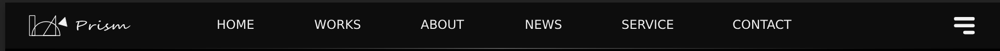

# 过程记录

## 环境准备
### nodejs
~~~
npm config get prefix
npm config set prefix D:\npm-cache
~~~

## 初始化项目
### npx create-nuxt-app px-web
~~~
npx create-nuxt-app px-web
npm ERR! code ENOENT
npm ERR! syscall lstat
npm ERR! path C:\Users\wangdayang1\AppData\Roaming\npm
npm ERR! errno -4058
npm ERR! enoent ENOENT: no such file or directory, lstat 'C:\Users\AppData\Roaming\npm'
npm ERR! enoent This is related to npm not being able to find a file.
npm ERR! enoent

npm ERR! A complete log of this run can be found in: D:\npm-cache\_logs\2025-04-09T03_17_42_713Z-debug-0.log
~~~
以上报错是 没有修改npm全局模块安装路径，通过上述修改prefix目录可解决

测试是否初始化项目成功
~~~
npm run dev
~~~

手动创建子目录

    - 按原型划分页面
      ```bash
      # UI组件的聚合形成了页面
      📁 pages
      │
      ├── 📁 Home            # 首页
      ├── 📁 Works           # 作品
      ├── 📁 About           # 关于我们
      ├── 📁 News            # 新闻
      ├── 📁 Service         # 服务
      └── 📁 Contact         # 联系
      ```
    - 按功能模块拆分UI组件
      ```bash
      # 使用PrimeVue组件库实现UI组件
      📁 components
      │
      ├── 📁 Header            # 头部组件
      ├── 📁 Footer            # 底部组件
      ├── 📁 CarouselImage     # 轮播图组件
      ├── 📁 ListImage         # 列表图组件
      ├── 📁 WaterfallFlow     # 瀑布流组件
      ├── 📁 introduce         # 介绍组件
      ├── 📁 news              # 新闻组件
      ├── 📁 business          # 业务组件
      └── 📁 process           # 流程组件

（Nuxt 3 同样没有强制要求 pages 目录下页面文件的首字母必须大写。不过，为了保持代码的一致性与可读性，社区依然推荐使用 PascalCase 来命名页面组件）

### 集成tailwind
官网： https://www.tailwindcss.cn/
~~~
# 3的版本资料比较多，先安装个3，4的版本npx tailwindcss init命令取消了
npm install -D tailwindcss@3
npx tailwindcss init
~~~
在 nuxt.config.ts（如果是 Nuxt 3）或 nuxt.config.js（如果是 Nuxt 2）中引入刚刚创建的 Tailwind CSS 文件，并配置 PostCSS 插件。
~~~
import { defineNuxtConfig } from 'nuxt/config'

export default defineNuxtConfig({
  css: ['@/assets/css/tailwind.css'],
  postcss: {
    plugins: {
      tailwindcss: {},
      autoprefixer: {},
    },
  },
})
~~~

### vscode 调试

Run --》 add configration会创建 .vscode/launch.json,添加内容如下
~~~
{
    // Use IntelliSense to learn about possible attributes.
    // Hover to view descriptions of existing attributes.
    // For more information, visit: https://go.microsoft.com/fwlink/?linkid=830387
    "version": "0.2.0",
    "configurations": [
       {
            "name": "Run npm dev",
            "type": "node",
            "request": "launch",
            "runtimeExecutable": "npm",
            "runtimeArgs": [
                "run",
                "dev"
            ],
            "cwd": "${workspaceFolder}",
            "console": "integratedTerminal"
        }
    ]
}
~~~
然后开始运行 Run --》 start debugging

## 前端开始
### 设置前端整体样式
#### 设置字体
豆包搜索
在 Nuxt 项目中使用 Tailwind CSS 并以 rem 作为尺寸单位，怎么设置1rem的大小

https://www.doubao.com/thread/w334788a0f0df2118

assets/css/tailwind.css
~~~
@tailwind base;
@tailwind components;
@tailwind utilities;


html {
    font-size: 16px; /* 默认情况下 1rem 等于 16px */
}

/* 当屏幕宽度小于等于 768px 时 */
@media (max-width: 768px) {
    html {
        font-size: 14px; /* 此时 1rem 等于 14px */
    }
}

/* 当屏幕宽度小于等于 480px 时 */
@media (max-width: 480px) {
    html {
        font-size: 12px; /* 此时 1rem 等于 12px */
    }
}
~~~

tailwind.config.js
~~~
/** @type {import('tailwindcss').Config} */

// tailwind.config.js
module.exports = {
  content: [
    "./components/**/*.{js,vue,ts}",
    "./layouts/**/*.vue",
    "./pages/**/*.vue",
    "./plugins/**/*.{js,ts}",
    "./nuxt.config.{js,ts}",
    "./app.vue",
  ],
  theme: {
    fontSize: {
      xs: ['0.75rem', { lineHeight: '1rem' }],
      sm: ['0.875rem', { lineHeight: '1.25rem' }],
      base: ['1rem', { lineHeight: '1.5rem' }],
      // 其他字体大小设置...
    },
    spacing: {
      px: '1px',
      0: '0',
      0.5: '0.125rem',
      1: '0.25rem',
      // 其他间距设置...
    },
    extend: {},
  },
  plugins: [],
}
~~~

nuxt.config.ts 中设置
~~~
// https://nuxt.com/docs/api/configuration/nuxt-config
export default defineNuxtConfig({
  compatibilityDate: '2024-11-01',
  devtools: { enabled: true },
  css: [
    '@/assets/css/tailwind.css'
  ]
})

~~~

#### 设置通用导航栏/页脚
app.vue --> layouts/default.vue --> page/index.vue
#layouts 不是 layout


app.vue 是总的页面入口
~~~
<template>
  <div>
    <NuxtLayout>
      <NuxtPage />
    </NuxtLayout>
  </div>
</template>

<script setup>
// 无需额外逻辑，页面会根据路由和布局自动渲染
</script>

<style scoped>
/* 这里是 app.vue 组件的局部样式 */
</style>

<style>
/* 引入全局的 main.css 文件 */
@import '@/assets/css/main.css';
</style>
~~~

#疑问点 main.css 在app.vue 导入后，是否其他页面也生效

clausd-3.7提问


~~~
你是一名专业且严谨的前端技术研发人员，你将遵循以下准则进行前端代码编写：
代码风格
框架使用nuxt，tailwind的代码风格
使用<script setup> 的方法
根据输入的图片创建一个导航栏
~~~

生成代码
~~~
<template>
  <header class="bg-black text-white w-full">
    <div class="container mx-auto px-4 flex items-center justify-between h-16">
      <!-- Logo -->
      <div class="flex items-center">
        <router-link to="/" class="flex items-center">
          <span class="text-2xl font-light mr-1">Prism</span>
        </router-link>
      </div>
      
      <!-- Desktop Navigation -->
      <nav class="hidden md:flex items-center space-x-8">
        <NuxtLink to="/" class="hover:text-gray-300 transition-colors">HOME</NuxtLink>
        <NuxtLink to="/works" class="hover:text-gray-300 transition-colors">WORKS</NuxtLink>
        <NuxtLink to="/about" class="hover:text-gray-300 transition-colors">ABOUT</NuxtLink>
        <NuxtLink to="/news" class="hover:text-gray-300 transition-colors">NEWS</NuxtLink>
        <NuxtLink to="/service" class="hover:text-gray-300 transition-colors">SERVICE</NuxtLink>
        <NuxtLink to="/contact" class="hover:text-gray-300 transition-colors">CONTACT</NuxtLink>
      </nav>
      
      <!-- Mobile Menu Button -->
      <button 
        @click="toggleMobileMenu" 
        class="md:hidden flex flex-col justify-center items-center"
        aria-label="Toggle menu"
      >
        <div class="w-6 h-0.5 bg-white mb-1.5"></div>
        <div class="w-6 h-0.5 bg-white mb-1.5"></div>
        <div class="w-6 h-0.5 bg-white"></div>
      </button>
    </div>
    
    <!-- Mobile Navigation -->
    <div 
      v-if="mobileMenuOpen" 
      class="md:hidden bg-black absolute top-16 left-0 w-full z-50"
    >
      <div class="container mx-auto px-4 py-4">
        <div class="flex flex-col space-y-4">
          <NuxtLink to="/" class="hover:text-gray-300 transition-colors py-2">HOME</NuxtLink>
          <NuxtLink to="/works" class="hover:text-gray-300 transition-colors py-2">WORKS</NuxtLink>
          <NuxtLink to="/about" class="hover:text-gray-300 transition-colors py-2">ABOUT</NuxtLink>
          <NuxtLink to="/news" class="hover:text-gray-300 transition-colors py-2">NEWS</NuxtLink>
          <NuxtLink to="/service" class="hover:text-gray-300 transition-colors py-2">SERVICE</NuxtLink>
          <NuxtLink to="/contact" class="hover:text-gray-300 transition-colors py-2">CONTACT</NuxtLink>
        </div>
      </div>
    </div>
  </header>
</template>

<script setup>
import { ref } from 'vue';

const mobileMenuOpen = ref(false);

const toggleMobileMenu = () => {
  mobileMenuOpen.value = !mobileMenuOpen.value;
};
</script>

<style scoped>
/* 可以添加额外的自定义样式，如果Tailwind不足以满足需求 */
</style>
~~~


