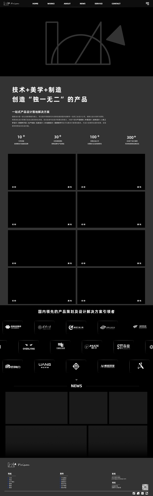

# pc端设计回顾
框架：nuxt + element plus + tailwind  
设计稿：

## code过程
部署采用element 框架的
~~~
<template>
  

    <el-container>
      <el-header>
        <NavBarComponent />
      </el-header>
      <el-main>
        <slot />
      </el-main>
      <el-footer>
        <FooterComponent />
      </el-footer>
    </el-container>
  

</template>

~~~
# 问题一：
你讲的 配置自动转换后，就可以全程用px为单位画页面，这个不太理解怎么设置

# 问题二
对于尺寸的设计疑问，哪些要用px写死，哪些是用内容来撑起元素的高和宽  
举例说明：导航栏  
我在做的时候，分为三部分，分别是 logo ， 主体， 隐藏栏
，但是在实际做的时候，直接用了element自带的el-menu-item

设计稿的尺寸中
1. 整个导航栏高度 89.6px ，我理解这里可以写css的时候，直接设置高度写死 h:89.6px
2. logo 和 主体之间宽度w：167px，我理解可以用margin写死
3. 主体中间元素相关间距118px，我理解这里可以不写死，让框架处理元素之间的排列

~~~
<template>
  

      <el-menu
        :default-active="activeIndex"
        class="bg-gray-200"
        mode="horizontal"
        :ellipsis="false"
        @select="handleSelect"
      >
        <el-menu-item index="0" class="p-4">

            
              
        </el-menu-item>
        <el-menu-item index="1">
          <NuxtLink to="/" class="text-sm font-bold lg:text-base hover:text-gray-300 transition-colors">HOME</NuxtLink>
        </el-menu-item>
        <el-menu-item index="2">
              <NuxtLink to="/works" class="text-sm font-bold lg:text-base hover:text-gray-300 transition-colors">WORKS</NuxtLink>
        </el-menu-item>
        <el-menu-item index="3">
              <NuxtLink to="/about" class="text-sm font-bold lg:text-base hover:text-gray-300 transition-colors">ABOUT</NuxtLink>
        </el-menu-item>
        <el-menu-item index="4">
              <NuxtLink to="/news" class="text-sm font-bold lg:text-base hover:text-gray-300 transition-colors">NEWS</NuxtLink>
        </el-menu-item>
        <el-menu-item index="5">
              <NuxtLink to="/service" class="text-sm font-bold lg:text-base hover:text-gray-300 transition-colors">SERVICE</NuxtLink>
        </el-menu-item>
        <el-menu-item index="6">
              <NuxtLink to="/contact" class="text-sm font-bold lg:text-base hover:text-gray-300 transition-colors">CONTACT</NuxtLink>
        </el-menu-item>

        <el-menu-item index="7">
          <el-dropdown>
            
            <template #dropdown>
            <el-dropdown-menu>
              <el-dropdown-item>Action 1</el-dropdown-item>
              <el-dropdown-item>Action 2</el-dropdown-item>
              <el-dropdown-item>Action 3</el-dropdown-item>
              <el-dropdown-item disabled>Action 4</el-dropdown-item>
              <el-dropdown-item divided>Action 5</el-dropdown-item>
            </el-dropdown-menu>
            </template>
          </el-dropdown>
        </el-menu-item>
      </el-menu>
  

</template>

~~~

# 问题三
用框架的时候，发现没特别和设计稿匹配的组件怎么办

